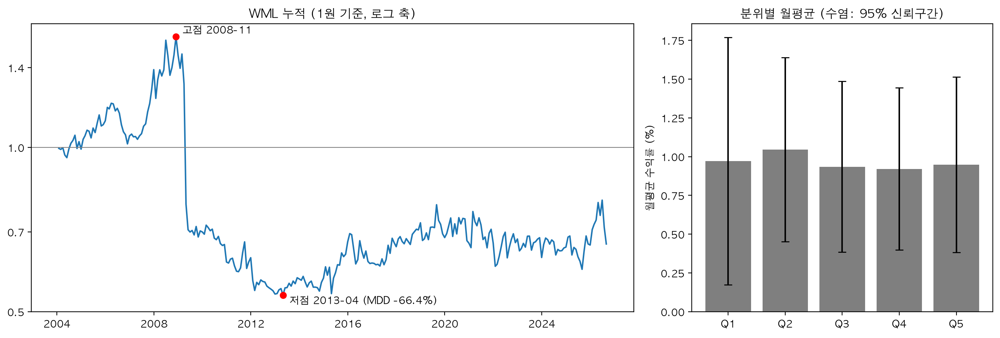
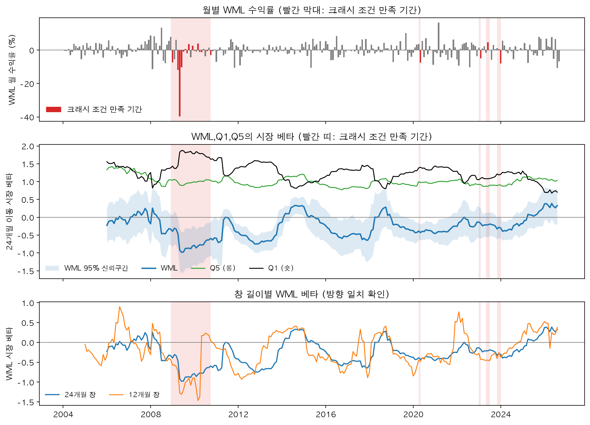

# 미국 대형주 모멘텀 크래시, 2004~2026
본 프로젝트는 2004~2026년 PIT S&P 500 데이터를 사용해 해당 기간동안의 모멘텀 크래시에 대해서 알아본다. 그 이전에 S&P 500에 모멘텀이 존재했는지 먼저 판단한다. 6-1 모멘텀 전략을 사용해 롱숏포트폴리오를 구축하여 백테스트를 진행했고, 월 평균 −0.02% (t −0.07, 95% CI [−0.60%, +0.55%])이 도출됐고 판단이 불가했다. 표준 모멘텀 팩터 UMD도 2009년 이후 17년간 0과 구별되지 않았다.

내 WML이 모멘텀을 재고 있음을 UMD와 대조해 확인한 뒤(상관 0.77) 모멘텀의 붕괴에 대해 탐구했다. 약세장 뒤 반등 달에 모멘텀 크래시가 발생한다는 D&M 조건으로 모멘텀 조건 달 21개, 사건 5개가 잡혔고, D&M이 보지 못했던 2020년이 포함됐다. 모멘텀 크래시 직전의 모멘텀 전략은 다섯 사건 모두 시장 β가 음수였고, 그 출처는 숏포지션의 고베타였다. 모멘텀 크래시 조건에 만족하는 달의 수익률은 평소보다 유의하게 나빴다.
다만 2020년은 β로 손실 대부분이 설명되는 반면 2009년 4월은 8분의 1만 설명되고, 그달 Q1의 수익률은 β로 예상한 것의 3배로 튀었다.

정리하면, 이 기간 대형주 모멘텀의 크래시는 시장이 폭락할 떄가 아니라 약세장 뒤 반등하는 달에, 롱이아닌 숏포지션에서, 숏포지션의 종목 전체가 오르면서 발생했다. 다만 조건 달 손실의 82%를 2009년 하나가 차지하고, 손실이 난 나머지 세 사건은 -8% ~ -5%, 한 사건은 양수라, 2009년 같은 크기의 크래시가 얼마나 자주 오는지는 이 표본으로 설명할 수 없었다.


## 계기와 프로젝트 질문
모멘텀은 주가가 일정한 방향으로 관성을 가지고 계속 나아가려는 현상을 말한다. Jegadeesh와 Titman(1993)이 보고한 이후 가장 많이 연구된 현상 중 하나다. 이 전략을 직접 구현해 보려고 현재 살아있는 대형주 42개로 2009~2012년 백테스트를 먼저 돌려봤었다.

결과는 모멘텀과 오히려 역방향처럼 보였고,특히 2009년 4월 한 달 동안 과거 패자 종목이 평균 81.6% 오르면서 숏포지션 쪽에서 큰 손실이 난 것을 확인했다. 찾아보니 이는 Daniel과 Moskowitz(2016)가 정리한 모멘텀 크래시, 즉 약세장이 끝나고 시장이 반등할 때 패자 종목이 급등해 모멘텀 전략이 무너지는 현상처럼 보였다. 이 현상을 파일럿보다 제대로 된 데이터로 직접 포착하고 연구해보고 싶어졌다.

**모멘텀은 2004~2026년 미국 대형주에서 존재하는가. 무너진다면 언제, 왜, 얼마나, 어디서 무너지는가.**

프로젝트의 무게는 뒤 질문에 있다. 모멘텀의 존재 자체는 이미 문헌으로 확립되어 있으므로, 앞의 질문은 새로운 발견을 위한 것이 아니다. 파일럿에서 역방향으로 관측된 결과가 제대로 된 표본에서도 유지되는지 직접 확인해보고, 이후 분석의 기준선을 잡는 목적이다. 

전체 프로젝트는 크게 데이터, 존재, 검증, 붕괴 순으로 진행됐다.

## 데이터 - 01_build_universe · 02_build_prices · 03_check_data
### 시점별 S&P 500 명단 (01_build_universe)
파일럿의 가장 큰 문제는 '생존편향'이었다. 2009년에는 S&P 500 명단에 있었지만 파산,합병 등으로 사라진 회사는 현재 표본에서 사라지고 그 명단으로 백테스트를 할 경우 롱포지션은 수익률이 과대평가되고, 숏포지션은 수익률이 과소평가된다. 그래서 Sharadar의 S&P 편입,편출 이력을 사용하여 매 월말 기준 S&P 회원 명단을 만들었다. 이 명단은 백테스트에서 매월 모멘텀 순위를 매기기 전 마스킹 역할을 하므로 그당시 S&P 구성종목이 아닌 종목은 순위 산출에서 제외된다.

### 상장폐지 포함 수정주가 (02_build_prices)
해당 파일에서는 Sharadar의 SEP 데이터를 사용하여 상장폐지종목을 포함하여 지금까지 한번이라도 S&P 500 구성종목에 포함된 모든 종목들의 매 월말 수정주가 표를 만든다. 명단에 상장폐지 회사를 넣어도 그 회사의 가격이 없으면 순위에서 조용히 빠지고, 그러면 생존편향이 가격 쪽에서 되살아난다. 그래서 가격표도 상장폐지 종목까지 포함해야 한다. 또한, S&P 회원 명단이 매달 바뀌니까 한 번이라도 들어간 종목 전부의 가격이 필요하다.

### 두 데이터 맞물림 확인 (03_check_data)
매 월말 S&P 명단에 존재하는 종목이 전부 그달 가격을 가지는지 확인했다. 명단에 있는데 가격이 없으면(NaN) 그 종목은 에러 없이 순위 산출에서 빠지고, 상장폐지 종목이 그렇게 빠지면 생존편향이 되살아나기 때문에 해당 파일로 확인이 필요하다. 결과는 273개월 전부 100%로 가격이 존재했다.

### 데이터 출처
1. 출처 
가격 패널: Sharadar SEP closeadj (수정주가 반영, 상장폐지 종목 포함, 1998~)
명단 패널: Sharadar SP500 (편입·편출 실제 날짜, 1998~)
팩터: Ken French FF3 + Momentum (무료, data/raw/에 포함)
2. 사용 데이터 범위
Sharadar SP500 : 2003-12 ~ 2026-08 273개월
Sharadar SEP closeadj : 2003-05 ~ 2026-08 279개월
           
## 존재 - 10_backtest
### 전략 구성
| 항목 | 설정 |
|---|---|
| 시그널 | 6-1 모멘텀 (과거 6개월 수익률, 직전 1개월 제외) |
| 유니버스 | 시점별 S&P 500 구성종목 |
| 분위 | 5분위 (각 약 100종목) |
| 가중 | 동일가중 |
| 포지션 | 롱숏: Q5 매수 − Q1 매도 |
| 리밸런싱 | 월별, 월말 |

**계산 규약**
- 누적수익·MDD·CAGR: 복리 누적
- 월평균·t·크래시 기여 분해: 산술 합/평균. 크래시 비용 연율은 월 × 12
- 연 변동성: 월 σ × √12(매월 수익률 독립 가정). Sharpe 분자는 산술 월평균 × 12
- 왜도·첨도: 월별 수익률 기준. z는 전체 기간 월평균, 월 σ로 정규화
- β 회귀의 시장은 Mkt-RF(초과수익), 크래시 조건의 시장은 Mkt-RF + RF(총수익)

이하 WML(Winners Minus Losers)은 이 전략을 말한다.


6-1 모멘텀과 동일가중은 Jegadeesh & Titman(1993)을 따랐다.5분위는 파일럿(42종목)에서 분위당 최소 8종목을 확보하려고 정한 설정이며, S&P500에서도 그대로 유지했다.
시그널에서 직전 1개월을 제외하는 이유는 단기 반전 효과 때문이다. 직전 달의 호가반동,유동성 압력에 의해 되돌림이 생기면 모멘텀 효과가 과소평가될 수 있다. 

### 결과
| 지표 | 값 |
|---|---|
| 월평균 Q5−Q1 | −0.02% (t −0.07, 95% CI [−0.60%, +0.55%]) |
| CAGR / 연 변동성 / Sharpe | −1.78% / 16.8% / −0.02 |
| MDD | −66.4% (2008-11 → 2013-04, 미회복) |
| 왜도 / 초과첨도 | −2.06 / 16.3 (거의 전부 2009-04 한 달, z = −8.2) |
| Rank IC | 평균 +0.001, ICIR 0.008, t 0.13 |

| 분위별 월평균 (%) | Q1 | Q2 | Q3 | Q4 | Q5 |
|---|---|---|---|---|---|
| 2004-01 ~ 2026-08 | 0.97 | 1.05 | 0.94 | 0.92 | 0.95 |



**판정 : 모멘텀 유무 판단 불가** 

Q5-Q1의 월평균 수익률의 t값 -0.07, CI가 0을 포함하여 유의하지 않으므로 0과 구별되지 않고, Rank IC도 같은 이유로 0과 구별되지 않는다. 분위별 월평균을 보면 5개 분위의 수익률이 평평하다. 다만, CI 상한이 +0.55%이므로 "없다"가 아니라, 약 월 0.6% 이상의 프리미엄만 배제되는 "판단 불가"다.

연 16.8%의 변동성을 가지면서 Sharpe는 0에 가깝고, 왜도 음수, 초과첨도 16.3으로 분포가 왼쪽 꼬리로 크게 치우쳐 있다. 2009년 4월 한 달을 월평균과 월 표준편차로 정규화를 진행했을떄 z가 약 -8.2가 나왔다. 왜도와 첨도 거의 전부를 이 한달이 만든 것이였다. 표와 MDD값을 보면 2009년 경 모멘텀 전략의 급락 이후 아직까지 그 고점을 회복하지 못하고 있다. 초과첨도와 왜도 또한 2009년 4월 한달이 대부분의 비중을 차지하고 있다. 

파일럿의 강한 역방향(Q5−Q1 월 −2.56% (t -1.39))은 사라졌다. 반등장 4년만 본 결과였다.
다만 파일럿에서 관측한 모멘텀 전략의 붕괴는 제대로 된 표본에서도 관측됐다. 이러한 모멘텀의 붕괴가 언제, 왜, 얼마나, 어디서 일어나는지는 붕괴 절에서 본다.

### 유니버스를 현재 S&P 명단으로 바꾸면? (UNIVERSE = "today")
| | PIT 명단 | 오늘 명단 (2026-08 구성종목) |
|---|---|---|
| 월평균 Q5−Q1 (t) | −0.02% (−0.07) | −0.10% (−0.38) |
| 연 변동성 / Sharpe | 16.8% / −0.02 | 15.5% / −0.08 |
| MDD | −66.4% | −70.4% |
| Q1~Q5 월평균 (%) | 0.97 / 1.05 / 0.94 / 0.92 / 0.95 | 1.66 / 1.35 / 1.18 / 1.16 / 1.56 |
| 종목 수 (월) | 약 500 | 약 445 (369 → 501) |

**판정 : 유지(판단 불가)**

S&P구성종목을 PIT에서 현재 구성종목으로 바꿔서 같은 지표를 측정해봤다.

PIT명단 일때와 비교해서 모든 분위에서 수익률이 부풀었다. 지금까지 살아남는 종목들만 과거에 골랐기 때문이다. 롱온리였다면 수익률이 과대평가 됐을 것이다. 다만 롱숏에서는 대부분 상쇄되고, Q1이 더 부풀어 Q5-Q1은 오히려 -0.08%p 낮아졌다. PIT의 Q1에 있던 파산, 편출 종목들은 숏포지션의 이익이였는데, 오늘 명단에는 없어서 제외되고 살아남아 반등한 종목만 Q1에 있기 때문이다. 오늘 명단으로 백테스트 한 Q5-Q1의 월평균 수익률도 유의하지 않으므로(|t| < 2) 0과 구별되지 않는다. 오늘 명단 501개 중 2004년에 가격이 있는 종목은 369개뿐이라, 초반에는 분위당 약 74종목으로 돌아간다.

## 검증 - 20_validate_umd
### 왜 French UMD와 비교하나
존재 절의 "평균 0"은 모멘텀이 없어서일 수도, 설계가 모멘텀을 못 잡아서일 수도, 코드가 틀려서일 수도 있다. 붕괴 절이 이 WML을 사용하여 진행되므로, 넘어가기 전에 이 시계열이 모멘텀을 제대로 재고 있는지를 독립적으로 만들어진 같은 종류의 시계열과 맞춰 확인해야한다.

French UMD는 Kenneth French 데이터 라이브러리(Fama-French 3팩터 모델의 French가 관리)의 표준 모멘텀 팩터로, CRSP 데이터로 만들어져 자산가격 연구의 표준 벤치마크로 쓰이며 우리 코드와 무관하다. 설계가 다르므로(12-1 시그널, 시가총액 가중,미국 전체 상장주) 상관 1을 기대하지는 않는다. 다만 같은 현상을 재고 있으면 높은 양의 상관이 나온다. 이 절은 이 코드의 모멘텀 시계열(WML)의 유효성 검증 단계이다.
### 결과
| 지표 | 값 |
|---|---|
| corr(WML, UMD) | 0.767 (2004-01 ~ 2026-07, 271개월) |
| 단순회귀 WML = α + β·UMD | β 0.850 (t 19.6), α −0.12%/월 (t −0.64), R² 0.588 |
| Carhart 4팩터 (Mkt-RF, SMB, HML + UMD) | UMD 계수 0.831 (t 17.4) |

**판정 : 통과**

WML과 표준 모멘텀 팩터인 UMD의 상관계수는 0.767이다. 또한 WML을 UMD에 회귀했더니 β가 0.85가 나왔고, t는 19.6으로 유의한 결과가 나왔다. 이 두 지표는 WML이 UMD와 같은 방향으로 움직인다는 것을 보여 준다. 다만 WML과 UMD 둘다 동일하게 다른 시장 팩터의 영향을 내포하고 있을 수 있으므로, Carhart 4팩터에 다중회귀를 함께 진행했고 UMD팩터의 β값이 단순회귀때와 거의 동일하게 나왔다. 따라서 WML과 UMD가 같이 움직이는 것은 시장·사이즈·밸류를 공유해서가 아니라 같은 현상(모멘텀)을 재고 있다는 것을 알 수 있다. 

다만 "통과"의 기준을 결과를 보기 전 숫자로 정해놓지는 않았다. 다른 설계 방식을 가지고 상관계수 0.767은 설계 차이로 설명 가능한 범위라고 생각했지만, 직접 차이를 하나씩 분해해 확인하지는 않았다(한계 절).

검증이 끝났으니, UMD를 통해 존재 절의 "판단 불가"를 해석해봤다.

| French UMD 구간 | 월평균 | t | 개월 |
|---|---|---|---|
| 1927 ~ 1969 | +0.68% | +2.99 | 516 |
| 1970 ~ 1992 | +0.81% | +3.71 | 276 |
| 1993 ~ 2008 | +0.92% | +2.57 | 192 |
| 2009 ~ 2026 | −0.04% | −0.14 | 211 |

UMD는 1927~2008년 82년간 월 +0.76%로 모멘텀이 분명히 있었고, 발표(1993) 후 16년은 100년 중 최고였다. 그런데 2009년 이후 17년간 월평균을 0과 구별할 수 없다. 즉 존재 절의 판단 불가는 이 코드의 설계의 단순성과 오류가 아니라 시장 전체에서 2009년 크래시 이후 나타난 현상이란 걸 알 수 있다. 그런 크래시가 어떤 조건에서 오고, 2009년 한 번뿐이였는지, 그때 전략의 어디가 무너졌는지를 붕괴절에서 알아볼 것이다.

## 붕괴 - 30_crash
존재·검증 절에서 2009년 4월 한 달이 왜도, 첨도와 MDD에 큰 영향을 끼친 것을 확인했다. 해당 절에서는 2009년 4월 같은 크래시 현상이 어떤 조건에서 오고, 왜 오고, 얼마나 잃고, 전략의 어디가 무너지는지를 알아볼 것이다.

크래시 달은 Daniel & Moskowitz(2016)의 조건으로 고른다(이하 D&M 조건). 언제 크래시가 일어나는지 결과를 보기 전, 2009년과 2020년(코로나) 두 사건이 잡히는지 시험 문제로 정하였다. 2009년은 파일럿 백테스트 때부터 관측된 크래시이고, 2020(코로나)은 D&M의 표본(~2013) 밖에서 나온 급락, 급반등이라 모멘텀 크래시 조건으로 잡혀야 할 것이라고 생각하였다. 2020년이 안 잡혀도 조건을 바꾸지 않고 그대로 README에 쓰기로 했다.

크래시 달을 정의하는 데 D&M 조건을 쓴 이유가 있다. WML이 가장 나빴던 달을 고르는 것은 결과를 보고 과정에 적용하는 것이다.나빠서 고른 달이니 나쁜 것은 당연하고, 왜 나빴는지는 말해주지 않는다. 2009년 4월의 모습을 보고 "이런 달"이라고 조건을 만드는 것도 같은 문제다. 한 사건에 맞춘 조건이라 다른 사건도 잡아내는지 알 수 없다. 따라서 조건이 WML에 맞춰진 것이 아니라 시장 상태로 쓰여있어야 하고, 결과를 보기 전에 이미 정해져 있어야 한다. D&M의 조건은 둘을 만족하기 때문에 사용하게 돼었다. 

다만 해당 조건은 1932년 크래시,2009년 크래시를 보고 정해졌으므로, 2009년도 이 조건의 표본 안에 있다. 표본 밖 검증으로써 이 조건이 아직 못본 2020년이 잡히는지를 볼 수 있다.


  *위: WML 월별 수익률, 빨간 막대 = 조건 달, 띠 = 사건. 가운데: 24개월 β와 CI, Q5·Q1 β. 아래: 24 vs 12개월.*

### 1.언제 - 크래시 조건과 사건 5개

**Daniel & Moskowitz(2016)의 크래시 조건으로 2004~2026년에서 조건 달 21개, 사건 5개가 잡혔고, 2009년과 2020년(코로나 폭락)이 둘 다 포함됐다.**

D&M 조건은 두 개다.

| 조건 | 뜻 |
|---|---|
| 직전 24개월 시장 누적수익률 < 0 | 약세장을 지나왔다 |
| 당월 시장 수익률 > 0 | 그달 시장이 반등했다 |

참고로 두 번째 조건은 같은 달의 정보를 쓰므로 실시간 신호가 아니라 사후 분류다.

| 사건 | 조건 달 | 개월 | 최악 달 | 직전 24개월 시장 | 당월 시장 | WML | 사건 합계 |
|---|---|---|---|---|---|---|---|
| 1 | 2008-12 ~ 2010-09 | 15 | 2009-04 | −40.49% | +10.18% | −39.75% | −67.8% |
| 2 | 2020-04 | 1 | 2020-04 | −0.74% | +13.60% | −7.50% | −7.5% |
| 3 | 2023-01 | 1 | 2023-01 | −0.81% | +6.96% | −4.88% | −4.9% |
| 4 | 2023-05 ~ 06 | 2 | 2023-06 | −2.79% | +6.86% | +0.04% | +4.8% |
| 5 | 2023-11 ~ 12 | 2 | 2023-12 | −0.51% | +5.28% | −8.00% | −7.4% |

사건 합계를 더하면 조건 달 전체 손실은 −82.7%고, 그중 사건 1이 −67.8%(82%)다.

시장은 수익률은 French Mkt-RF + RF(총수익), 실현 월 기준이다. 조건을 만족하는 달이 3개월 이내로 이어지면 한 사건으로 묶었다. WML은 각 행의 사건 중 최악의 달을 기록한 열이다. 눈에 띄는 건 1번 사건, 직전 24개월동안 시장이 폭락했으며 당월에 10%가 폭등했다. 이 사건에서 약 -67.8%로 압도적으로 모멘텀이 붕괴됐다. 시장이 폭락한 달이 아니라 **약세 후,반등한 달**에 모멘텀 크래시가 일어났다.

조건 달은 총 21개이고, 21개 중 wml이 음수인 달 14개, 양수인 달 7개이다. 이 조건에 만족한다고 무조건 크래시가 일어나는 건 아니라는 것을 알 수 있다. 조건은 크래시가 일어난 달이 아니라 "크래시가 일어날 수 있는 상태"를 고른다. 실제로 사건 4는 조건을 만족하지만 WML이 양수였다. 

2020년은 조건에 잡하긴 했지만, 직전 24개월 -0.74%로 경계선에서 잡혔고 당월 WML -7.50%였다. 

### 2.왜 - 시장 beta 분석
약세장이 지속되는 상황에서도 모멘텀으로 순위를 매겨서 Q1,Q5를 구축해야 한다. 대부분이 하락을 하더라도 그 안에서 더 떨어지는 종목들과 잘 버티는 종목들이 나뉘어 진다. 그러므로 약세장 이후에 Q1에 있는 종목들은 다른 종목들보다 더 많이 떨어지는, 시장에 민감한 고베타 종목일 확률이 높다. 그리고 반대로 약세장 이후에 Q5에 있는 종목들은 다른 종목들보다 덜 떨어진 시장에 둔감한 저베타 종목일 확률이 높다. 그러면 Q5 매수 - Q1 매도인 WML은 시장에 역베팅인 상태가 되고(저베타 - 고베타), 이 상태에서 시장이 반등을 하면 숏포지션이 큰 손실을 입게된다. D&M의 설명도 이와 같았다. 이 설명이 맞다면 데이터에서 두 가지가 보여야 한다. 

(1)사건 직전(반등 직전)의 WML의 시장 β는 음수여야 한다.

(2)WML의 시장 β가 음수인 것은 Q1의 고베타에서 기인해야 한다.

β는 WML을 시장(Mkt-RF)에 회귀하여 측정하기로 했다. WML은 달러중립이기 때문에 수익률이 이미 초과수익률이여서 시장의 초과수익률로 회귀한다. 전체 기간의 β를 측정하면 시기마다 다른 β로 인해 사건 직전의 WML의 시장 β를 구할 수 없어, 이동 창을 사용하여 β의 시계열을 구하기로 했다. 기본은 24개월 창을 사용하고 12개월 창을 병기한다. 직전 β를 구하는 문제라면 더 짧은 창을 사용하는게 맞지만, 이 프로젝트에서는 월별 데이터를 사용하기 때문에 점의 개수가 너무 적어져서 회귀의 정확성이 떨어진다. 24개월 창과 12개월 창의 방향이 다르다면 24개월창이 과거 데이터에 치우쳐져 있다고 판단할 수 있다. β가 "꺾였다"는 판단 기준도 미리 정하였다. 사건 직전 달의 24개월 β가 (a) 음수이고, (b) 95% 신뢰구간의 상단이 0 미만이며, (c) 전체 기간 β 중앙값보다 낮을 때 "꺾였다"고 판단하기로 하였고, (b)를 못 넘으면 "음수 방향이나 0과 구별되지 않음"으로 기록한다.

| 사건 | 직전 달 | β_WML (24개월) | CI 상단 | β_WML (12개월) | β_Q5 | β_Q1 | 판정 |
|---|---|---|---|---|---|---|---|
| 1 (2009) | 2008-11 | −0.34 | +0.09 | −0.43 | +1.05 | +1.38 | 음수 방향, 0과 구별 안 됨 |
| 2 (2020) | 2020-03 | −0.39 | −0.14 | −0.45 | +1.00 | +1.38 | 꺾였다 |
| 3 (2023-01)| 2022-12 | −0.13 | +0.30 | −0.28 | +0.92 | +1.05 | 음수 방향, 0과 구별 안 됨 |
| 4 (2023-05) | 2023-04 | −0.21 | +0.13 | −0.45 | +0.87 | +1.08 | 음수 방향, 0과 구별 안 됨 |
| 5 (2023-11) | 2023-10 | −0.33 | −0.02 | −0.41 | +0.89 | +1.21 | 꺾였다 |

전체 기간 24개월 β 중앙값 −0.26. "꺾였다" = (a) β < 0, (b) CI 상단 < 0, (c) β < 중앙값.

(1) 다섯 사건 모두 직전 24개월의 β가 음수이다. 12개월 창도 다섯 사건 모두 음수로 방향이 같다. β가 "꺾였다"까지 간 것은 2020년과 2023년 11월이다. 다만 24개월 β는 창 전체의 평균 민감도라서 "크래시 직전에 β가 음수로 변한다"까지는 말할 수 없다. 위 그래프의 아랫쪽 그림에, 12개월 창이 다섯 사건 모두 24개월보다 더 음수인 것은 긴 창이 앞 기간에 희석된다는 뜻이다.

(2) 다섯 사건 모두 β_Q5 < β_Q1이다. β_WML = β_Q5 - β_Q1이기 때문에 음의 β의 출처는 Q1이다. 위 그래프의 중간 그림에서 Q1의 β를 나타내는게 검은 선이고, Q5의 β를 나타내는게 초록선인데 크래시 조건 달을 나타낸 빨간 음영구간에서 검은선이 항상 초록선 위에 있는 것이 이것이다.

가장 큰 모멘텀 크래시가 일어났던 2009년을 보면, 오히려 CI 상단이 양수이다. 이는 β의 크기때문이 아니다.(−0.34, 2020년 −0.39와 비슷) 신뢰구간이 넓었기 때문이다. β를 구하며 SE를 함께 출력했는데, SE가 2009년 0.22, 2020년 0.12이였다. 두 창의 시장 변동성은 월 5%로 같았다. 다만 코드로 두 기간의 직전 24개월 이동회귀 잔차의 표준편차를 출력해보니, 2009년 5%, 2020년 3%였다. 시장으로 설명되지 않는 WML의 변동이 2020년 창보다 2009년 창(2006-12~2008-11)에서 더 컸다. 2009년 창(2006-12~2008-11)에는 2008년 금융위기가 들어 있어 WML이 시장과 무관하게 크게 움직인 달이 많았던 기간이다.

| 최악 달 | 그달 직전 β_WML | × 당월 시장 | β로 설명되는 손실 | 실제 WML | 설명되는 몫 |
|---|---|---|---|---|---|
| 2009-04 | −0.46 (2009-03) | +10.18% | −4.7% | −39.75% | 약 8분의 1 |
| 2020-04 | −0.39 (2020-03) | +13.60% | −5.3% | −7.50% | 약 70% |

판정표(위의 큰 표)의 β는 사건 시작 직전 달(2008-11, 2020-03) 기준, 이 표는 최악 달 직전 기준.

"음의 β" 설명이 손실을 얼마나 설명하는지 최악 달 직전 β × 당월 시장으로 보면 위와 같다. 2020년은 대부분을 설명하지만 2009년은 8분의 1이다. 즉 "음의 β"는 붕괴의 방향은 맞히지만 2009년의 크기는 설명하지 못한다. 이는 4.에서 더 본다.

**결론 : 다섯 사건 모두 직전 달 WML의 시장 β가 음수였고, 그 출처는 숏포지션의 고베타였다. "약세장 뒤 음의 β" 설명은 붕괴의 방향을 맞히지만, 크기는 2020년만 설명하고 2009년은 8분의 1만 설명한다.**

### 3.얼마나 - 크래시 조건 달 vs 평상시 달, 사건별 손실
존재 절의 22년간 WML 평균은 0이었다. 평균을 크래시 조건 달과, 평상시 달로 나눠서 크래시 조건 달이 22년 평균을 얼마나 깎았는지 알아봤다.

평소 달 평균이 양수이고, t>=2이면 "평소엔 벌었고 크래시가 크게 깎았다.", 그 외에는 크래시 조건달을 뺴도 평소 수익이 0과 구별되지 않는 것으로 판단 기준을 세웠다.

| | 달 수 | 월평균 | t |
|---|---|---|---|
| 평소 달 | 250 | +0.34% | +1.29 |
| 크래시 조건 달 | 21 | −3.94% | −1.92 |
| 전체 | 271 | +0.00% | +0.01 |

전체 평균 = (평소 달 수 / 전체) × 평소 평균 + (조건 달 수 / 전체) × 조건 달 평균

위 식으로 평소 달 평균과, 조건 달 평균의 몫을 나눴다.

| 분해 | 값 |
|---|---|
| 평소 달의 몫 (250/271 × 0.34%) | +0.309%p |
| 조건 달의 몫 (21/271 × −3.94%) | −0.306%p |
| 크래시 비용 (평소 평균 − 전체 평균) | +0.331%/월, 연 약 4% |
| 조건 달 − 평소 달 차이 | −4.28%p (|t| 2.07) |

기간 2004-01 ~ 2026-07

**판정: 평소 달 평균 +0.34%는 t 1.29로 0과 구별되지 않지만, 조건 달이 평소보다 유의하게 나쁘다**

평소달은 0.34%지만 t값을 봤을때 유의하지 않다. 조건달의 |t|는 2에 못미치고, 표본 개수가 21개 밖에 되지 않아 SE를 구해보면 2.05%가 나온다. 따라서 95% 신뢰구간이 0을 포함하고 있어 이 또한 유의하지 않다고 할 수 있다. 다만 두 몫을 보면, 평소 달 250개가 만든 +0.31%p를 조건 달 21개가 -0.31%로 거의 정확히 상쇄했다. 몫의 바탕인 두 월평균 모두 t가 2 미만이라 점추정일 뿐이지만, 전체 평균이 0 근처인 모양은 이렇게 나왔다. 그리고 조건달은 평소 달보다 −4.28%p(= −3.94 − 0.34) 나빴고, 이 차이는 |t| 2.07로 유의하다. 즉 , "조건 달이 나쁘다"는 말은 못 해도 "조건 달이 평소보다 유의하게 나쁘다"는 말은 할 수 있다. 

다만 이 평소달과 조건달의 분해는 사후이다. "당월 시장 > 0"은 달이 끝나야 알 수 있으므로, 조건 달을 피해서 평소 수익을 얻을 수는 없다.

### 4.어디서 - 롱/숏 포지션 분해, Q1(숏 포지션) 내부
2.는 시장에 더 민감한 쪽이 Q1이라는 것(β를 통해)을 보였다. 여기서는 실제 손실이 어느 쪽에서 났는지를 포지션을 분해해 실현 수익률로 확인하고, 그다음 Q1 안에서 무슨 일이 있었는지 조금 더 들여다 보았다.

| 사건 | WML 합 | 롱 포지션 ΣQ5 | 숏 포지션 Σ(−Q1) | 숏 기여 / 손실 | 판정 |
|---|---|---|---|---|---|
| 1 | −67.75% | +81.18% | −148.93% | 220% | 숏 쪽 |
| 2 | −7.50% | +11.64% | −19.13% | 255% | 숏 쪽 |
| 3 | −4.88% | +7.23% | −12.12% | 248% | 숏 쪽 |
| 4 | +4.76% | +5.86% | −1.10% | — | 손실 없음 |
| 5 | −7.42% | +13.62% | −21.04% | 283% | 숏 쪽 |

먼저 짚고 갈 점은, WML 합과 롱 포지션, 숏 포지션의 수익률은 각 크래시 사건 기간의 월별 수익률을 단순 합으로 누적한 것이다(사이의 평소 달은 제외). 매달 WML = Q5 − Q1이므로 합으로 누적하면 ΣQ5 + Σ(−Q1) = ΣWML 이 정확히 성립하여 기여를 나눌 수 있기 때문이다. 복리로 누적하면 이 등식이 성립하지 않는다.

이 표에서 사건 4를 제외하면 롱은 벌고 숏은 더 잃었다. 이것은 2.에서 숏포지션의 고베타와, 위 그래프의 중간 그림에서 빨간 구간 동안 검은 선이 초록 선보다 위에 있음을 반영한다. 따라서 앞서 예상된 것과 같이 모멘텀 크래시 기간동안의 손실은 대부분이 숏 포지션에서 기인했음을 확인할 수 있다. 앞서 2.의 사건 1번 크래시(2009년)에서 최악 달의 그달 직전 β값으로 설명한 당월 수익률은 8분의 1밖에 안되었다. 나머지 8분의 7이 몇 종목이 튄 결과인지, 아니면 Q1 전체의 일인지를 보기 위해 Q1을 분해해 보았다.

| 2009-04 Q1 상위 10 | 수익률 | | 2020-04 Q1 상위 10 | 수익률 |
|---|---|---|---|---|
| TNL (당시 Wyndham) | +178.0% | | MRO | +86.0% |
| F | +127.3% | | DVN | +80.5% |
| PFG | +99.8% | | FANG | +66.2% |
| ODP | +97.7% | | NBL | +62.4% |
| WYNN | +96.5% | | NCLH | +49.6% |
| HST | +96.2% | | BFH (당시 Alliance Data) | +48.8% |
| THC | +94.0% | | RCL | +45.4% |
| DD | +89.8% | | OXY | +43.3% |
| AXP | +87.3% | | CPRI | +41.3% |
| TXT | +86.9% | | VLO | +39.7% |

| | 2009-04 | 2020-04 |
|---|---|---|
| Q1 한 달 수익률 | +43.44% | +19.13% |
| 상위 10개의 몫 | 24.3% | 29.1% |
| Q1 중 오른 종목 비율 | 95% | 92% |
| 직전 β_Q1 × 당월 시장 대비 실제 | 약 3배 | 약 1배 |


Q1 내부는 2009년과, 2020년을 봤다. 2020년은 D&M조건이 보지 못한 사건이기도 하고, 붕괴 절 시작전의 시험 문제였기 때문에 분해해 보았다. 2009년 4월 Q1의 +43.44%는 몇 종목이 튄 결과가 아니였다. Q1 약 100종목 중 95%가 올랐고, 상위 10개를 합쳐도 Q1 수익의 24%다. 2020년 4월도 같다(92%, 29%). 패자 분위 전체가 올랐다. 다만 크기가 달랐다. 그달 직전 β_Q1 × 당월 시장으로 설명되는 상승과 비교하면 2020년은 약 1배, 2009년은 약 3배다. 따라서 2009년에서 β로 설명하지 못하는 부분은 Q1 전체적인 급등으로 볼 수 있다. 업종은 2009년이 금융·자동차·여행·소매로 넓고, 2020년은 에너지 6개·크루즈 2개에 몰려 있다.

**결론 : 손실이 난 네 사건 모두 숏 포지션에서 났고 롱 포지션 벌었다. 2020년은 Q1이 β대로 움직인 크래시고, 2009년은 Q1 전체가 β의 3배로 튄 크래시다. 왜 3배인지는 이 설계로는 답할 수 없다.(한계 절)**


### 크래시 조건의 정의를 바꾸면? (BEAR_MONTHS · BEAR_MKT)
1.의 D&M 조건 중 "직전 24개월 시장 누적 < 0"의 24개월을 12개월과 36개월로, 그리고 시장을 총수익에서 초과수익(Mkt-RF)으로 바꿔서 1.~4.를 다시 돌렸다. 결과를 보기 전에 "바뀐다"를 정했다. 숫자가 아니라 판정 문구가 바뀔 때만 바뀐 것으로 본다.

| 정의 | 조건 달 | 사건 | 2020 포착 | 2. 2009 사건 직전 β | 2. 2020 사건 직전 β | 3. 평소 달 평균 (t) | 4. 숏 쪽 / 손실 사건 |
|---|---|---|---|---|---|---|---|
| 총수익 24개월 (주) | 21 | 5 | ○ | −0.34, 0과 구별 안 됨 | −0.39, 꺾였다 | +0.34% (1.29) | 4 / 4 |
| 총수익 12개월 | 26 | 8 | ○ | −0.34, 0과 구별 안 됨 | −0.39, 꺾였다 | +0.46% (1.81) | 8 / 8 |
| 총수익 36개월 | 24 | 2 | **×** | −0.34, 0과 구별 안 됨 | 사건 없음 | +0.30% (1.12) | 1 / 1 |
| 초과수익 24개월 | 28 | 5 | ○ | −0.34, 0과 구별 안 됨 | −0.39, 꺾였다 | +0.37% (1.43) | 5 / 5 |

2009·2020 사건의 시작 달은 정의에 따라 바뀌지 않아 사건 직전 β도 같다.

네 정의 모두 2. 사건 직전 β 음수, 3. 평소 달 평균이 0과 구별되지 않음, 4. 손실 사건 전부 숏 쪽이 유지된다. 바뀐 것은 하나, 36개월 창에서 2020년이 잡히지 않는다. 주 정의에서도 직전 24개월 −0.74%로 경계선이었으니, 2020년은 얕은 약세장 뒤 급반등이여서 창을 늘리니 약세장 자체가 사라졌다.
β 창 길이(24 vs 12개월)는 2. 표와 위 그래프의 아래 그림에, 유니버스 비교(PIT vs 오늘 명단)는 존재 절에 있다.

## 한계
- 모든 t값, 신뢰구간, 연환산 변동성은 달마다 수익률이 독립이라는 가정 위에서 계산했다.
- 4.사건별 손실과 롱,숏 분해는 조건 달 수익률의 단순 합이다. 따라서 실제 누적 손실과는 다르다. 
- 큰 크래시 사건이 사실상 하나다. 조건 달 손실 −82.7% 중 2009년이 −67.8%(82%)라, "2020년에도 같은 자리·같은 방향으로 무너졌다"까지만 말할 수 있고 일반화는 할 수 없다.
- 2009년 4월 Q1이 β의 3배로 오른 이유는 이 설계로는 알 수 없었다.
- 검증의 통과 기준은 결과를 보고 정했고, 상관 0.77이 설계 차이로 전부 설명되는지는 분해하지 않았다.
- 5분위는 파일럿에서 물려받은 설정이고 문헌 표준은 10분위다. 12-1 시그널, 10분위, 거래비용, 롱온리는 비교하지 않았다. 시가총액이 없어 동일가중만 썼다.
- 월말 종가 체결과 월말 전체 리밸런싱을 가정했다. 거래비용·공매도 비용을 넣지 않았다. 둘 다 크래시 달에 더 불리해서 실제 손실은 여기보다 클 방향이다.
- β를 24개월 평균으로 구해 사실은 "직전"이 아니라 "직전 2년 평균"이다.

## 재현 방법과 폴더 구조

**폴더 구조**
```
Project-1/
├─ README.md
├─ requirements.txt
├─ src/
│  └─ data.py                  데이터 불러오기 함수 모음 (가격·명단·French·결과 캐시)
├─ notebooks/
│  ├─ 01_build_universe.py     Sharadar SP500 → 월말 PIT 명단
│  ├─ 02_build_prices.py       Sharadar SEP → 월말 수정주가 (상장폐지 포함)
│  ├─ 03_check_data.py         명단·가격 맞물림 확인
│  ├─ 10_backtest.py           6-1 모멘텀 5분위 롱숏 → 존재 절
│  ├─ 20_validate_umd.py       French UMD 대조 → 검증 절
│  ├─ 30_crash.py              크래시 조건·β·분해 → 붕괴 절
│  └─ archive/                 파일럿(42종목), 위키 명단(구 사용 데이터)
├─ data/
│  ├─ raw/                     French FF3·Momentum CSV (리포에 포함)
│  ├─ universe/                위키 명단(구 사용 데이터), 파일럿 42종목 (포함)
│  └─ cache/                   Sharadar 원본·중간 결과 (gitignore, 재배포 금지)
└─ figs/                       existence.png, crash.png
```
**필요한 것**
- Python 3.12.9 , `pip install -r requirements.txt`
- Nasdaq Data Link의 Sharadar 구독(SEP, SP500 테이블)(유료데이터). API 키는 환경변수(NASDAQ_DATA_LINK_API_KEY)로 설정해야하고, 코드에 직접 입력하면 안된다.Sharadar은 라이선스 상 리포에 포함할 수 없다. data/cache 는 01,02 파일 실행 시 생성된다.

**실행 순서**
01 -> 02 -> 03 -> 10 -> 20 -> 30.
각 파일은 '# %%' 셀 별로 나뉘어 있다. 한번에 실행할 수도 있고, 셀 별로 실행할 수도 있다. 셀 별로 실행할 시 꼭 위의 셀부터 하나씩 실행해야 한다.

**참고**
- 10의 `UNIVERSE`와 30의 `BEAR_MONTHS`, `BEAR_MKT`는 강건성 검증 용 변수이다. `UNIVERSE = "pit"`로 돌려야 20,30이 읽는 캐시(`data/cache/ret_*_sp500.pkl`)가 저장된다.

- 이 프로젝트에서 사용된 Nasdaq Data Link의 Sharadar 데이터는 벤더가 과거 데이터를 수정할 수 있으므로 다른 날 받으면 실행 결과의 소숫점이 달라질 수 있다. 이 README의 숫자는 2026-09-25 스냅샷 기준이다.
- 이 프로젝트에 사용된 French CSV는 2026-07까지 포함된 버전이다. 새로운 버전을 받게되면 CSV의 기간 끝이 바뀐다. 이 README의 숫자는 2026-09-25 스냅샷 기준이다.

## AI 사용

Claude(Anthropic)를 다음에 사용했다.

- 출력 정리 : 결과를 표,그래프로 다듬는 코드와 마크다운 표 변환
- 방향 상의 : 
- 어려운 문법 : pandas,statsmodels,matplotlib에서 막힌 부분의 사용법
- 모르는 개념 : 이동 회귀, 생존편향 등 질문에 대한 설명
- 폴더 정리 : 파일 이름과 구조, 공용 로더(`src/data.py`) 분리
- READ ME 검토(크로스 체크) : READ ME 작성 후, 앞뒤가 안 맞거나 출력과 표의 숫자가 어긋난 곳 검토

분석 설계, 코드 작성, 판정은 직접 했다. 본문의 숫자는 모두 이 리포의 코드를 직접 실행한 출력이다.


